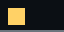

# rslides

`rslides` is a terminal-native presentation tool for Markdown slide decks.

It is built for live technical talks: fast startup, keyboard-first navigation, syntax-highlighted code blocks, and image rendering in modern terminals.



## Why rslides

- Markdown-first workflow
- Runs directly in the terminal (`kitty`, `iTerm2`, `ghostty`, and ASCII fallback)
- Code highlighting with `syntect`
- Slide transitions and fragment reveals
- Tables, callouts, quotes, lists, headings, and column layouts
- Custom color themes via a simple config file
- Source-available with non-commercial terms (free to fork/modify, not for sale)

## Quick Start

### 1. Build

```bash
cargo build --release
```

### 2. Run the bundled demo

```bash
cargo run -- demo.md
```

### 3. Run your own deck

```bash
./target/release/rslides my-talk.md
```

## CLI

```text
rslides [--theme <file>] <file.md>
```

Example:

```bash
rslides --theme theme.example demo.md
```

## Controls

- `l` / `Right` / `Down`: next slide (or next reveal fragment)
- `k` / `Left` / `Up`: previous slide (or previous reveal fragment)
- `q` / `Esc`: quit

When ANSI TUI mode is unavailable, `rslides` falls back to plain mode with:

- `n` (or `l`): next
- `p` (or `k`): previous
- `q`: quit

## Slide Authoring

Slides are split by `---`.

```md
# Slide One
Content

---

# Slide Two
More content
```

Per-slide config on delimiter lines:

```md
--- {columns: [2,3], image-mode: native, title: "Deep Dive"}
```

Supported keys:

- `columns`: integer ratios for layout (for example `[2,3]`)
- `image-mode`: `auto`, `ascii`, or `native`
- `title`: optional display title

### Directives

- Reveal fragments:

```md
<!-- reveal: on -->
```

- Slide line spacing:

```md
<!-- line_spacing: 2 -->
```

- Inline spacing spacer:

```md
<!-- line-spacing: 8 -->
```

- Column break:

```md
<!-- column: 1 -->
```

- Column alignment:

```md
<!-- align: center -->
```

### Images

Use standard Markdown image syntax:

```md
![ [valign: middle, halign: center, alt: "Image caption"] ](assets/demo.png)
```

Notes:

- One image per slide is supported.
- GIF animation works in ASCII mode and native image mode.
- SVGs are rasterized for native terminal rendering.

### Cover Slide

If the first slide contains only the fields below, it is parsed as a cover:

```md
title: My Talk
sub_title: Rust + Terminal UX
author: Jane Doe
image: assets/demo.png
```

## Theming

Pass a theme file with `--theme`.

Theme format:

```text
title_start=178,102,255
title_end=102,245,255
text=220,225,232
```

See [`theme.example`](theme.example) for all keys.

## Development

```bash
cargo check
cargo test
```

## Project Policy

This repository is published for transparency and reuse, but external pull requests are not accepted.

You are free to check, download, fork, and modify under the license terms.

For responsible disclosure, see [`SECURITY.md`](SECURITY.md).

## License

This project is source-available under a non-commercial license.  
Forking and modification are allowed; selling is not allowed. See [`LICENSE`](LICENSE).
